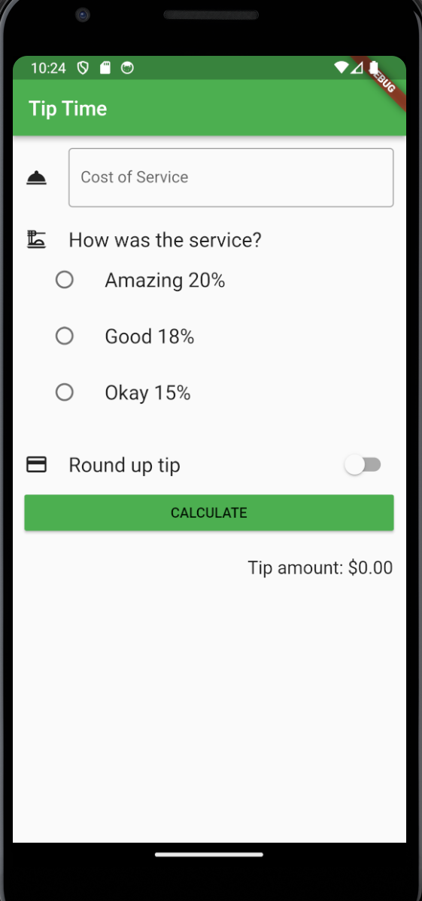
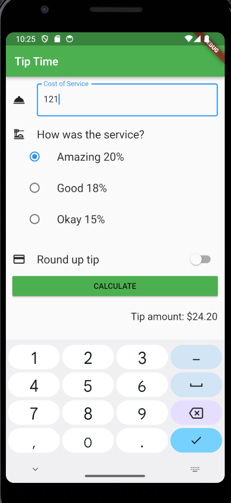
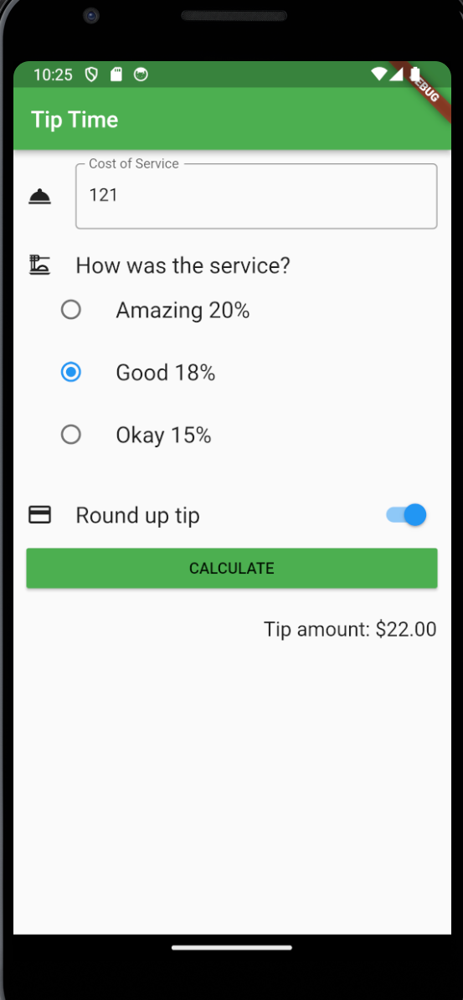

# App Tip_Time

* Uso de providers

# Lo que me costo mas trabajo
* En esta ocasión no hubo dificultades en el desarrollo mas que en saber si debes leer algo
del provider una vez o si lo debes observar constantemente.

# Lo que aprendi
* El uso correcto de providers
* El uso de ListTiles
* El uso de Radios
* El uso de switch

# Screenshots

